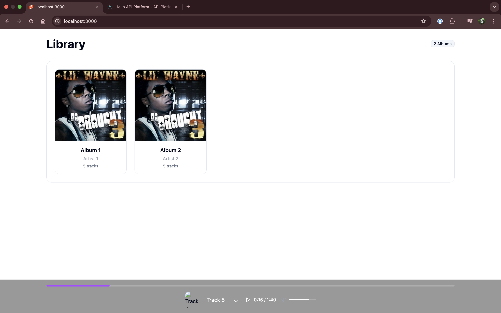
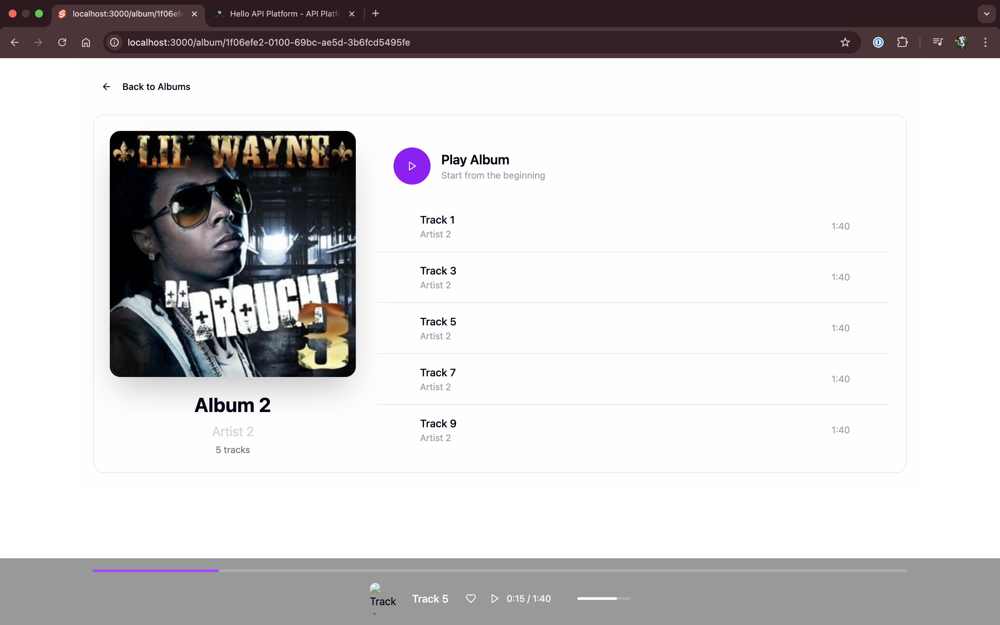
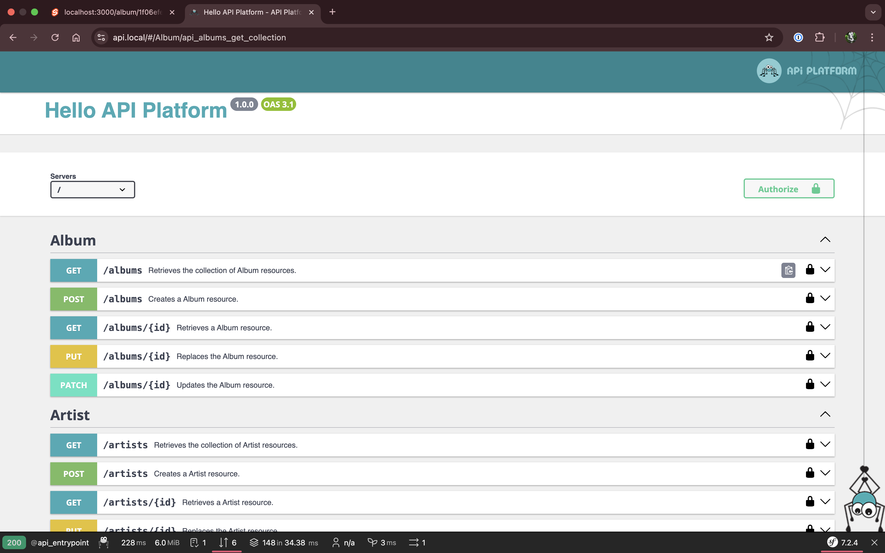

# SoundGlyph Portable API

SoundGlyph is an open-source portable music hosting API. Simply connect an S3 compatable bucket and the API will do the rest.




SoundGylph works through Glyphs, (or QR codes). The Mobile Application can collect and switch between multiple instances of the API through these Glyphs. Each instance has its' own authentication.

This repository contains the Symfony API, and a SvelteKit web frontend to manage the instance.

## Usage

Build the docker using:

```bash
docker compose up --build -d
```

Then navigate to `localhost:3000` for the web interface. To access the API, add `api.local` to your `/etc/hosts` and navigate to it. The Swagger spec can be accessed at root.



## Development

This repo is **heavily** under development. Any help is welcome. To use the Minio bucket for offline S3 storage, add this to `api/.env`.

```
S3_BUCKET=soundglyph
S3_REGION=us-east-1
S3_KEY=minioadmin
S3_SECRET=minioadmin
S3_ENDPOINT=http://s3:9000
```

## Documentation

Coming soon!

## Credits

Created by Sam Laister @2025.